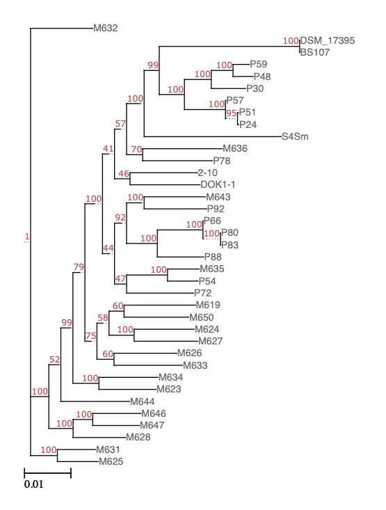

# Synteny analysis of Phaeobacter inhibens genomes
Using SibeliaZ, maf2synteny, PanACoTA

# Get Genomes from NCBI
All Phaeobacter inhibens genomes were accessed from the S4Sm assembly page located here https://www.ncbi.nlm.nih.gov/genome/13044?genome_assembly_id=2187178 by clicking on RefSeq link for all related genomes

```bash
wget -r -e robots=off https://ftp.ncbi.nlm.nih.gov/genomes/refseq/bacteria/Phaeobacter_inhibens/latest_assembly_versions/
```
## Remove incomplete genomes from folder
There are currently (5/2023) 44 submissions on NCBI for Phaeobacter inhibens genome assemblies. All but three were complete. The three still at the scaffold level were excluded and are listed below.

| Strain              | Assembly               |
|---------------------|------------------------|
|        2-1005.fasta |        GCA_947489905.1 |
|           DSM 16374 |        GCA_000473105.1 |
|                S4Sm |        GCA_001559785.1 |

## Table of input genomes
These genomes were used in the analysis
| Strain           | Origin  | Total Length     | Assembly number        |
|------------------|---------|------------------|------------------------|
|              2.1 | unknown |        4,160,918 |        GCA_000154745.2 |
|             2.10 | unknown |        4,160,913 |        GCA_003443555.1 |
|            BS107 | unknown |        4,188,145 |        GCA_003443575.1 |
|           DOK1-1 | Dokdo   |        4,291,376 |        GCA_001969345.1 |
|        DSM 17395 | unknown |        4,227,134 |        GCA_000154765.2 |
|             M619 | China   |        4,178,771 |        GCA_025142455.1 |
|             M623 | China   |        4,314,694 |        GCA_025142595.1 |
|             M624 | China   |        4,204,626 |        GCA_025142675.1 |
|             M625 | China   |        4,281,685 |        GCA_025142695.1 |
|             M626 | China   |        4,163,548 |        GCA_025142715.1 |
|             M627 | China   |        4,244,751 |        GCA_025142735.1 |
|             M628 | China   |        4,301,253 |        GCA_025142755.1 |
|             M631 | China   |        4,314,012 |        GCA_025142775.1 |
|             M632 | China   |        4,139,108 |        GCA_025142795.1 |
|             M633 | China   |        4,402,211 |        GCA_025142815.1 |
|             M634 | China   |        4,089,150 |        GCA_025142835.1 |
|             M635 | China   |        4,301,151 |        GCA_025142855.1 |
|             M636 | China   |        4,283,941 |        GCA_025143105.1 |
|             M643 | China   |        4,114,628 |        GCA_025143215.1 |
|             M644 | China   |        4,284,518 |        GCA_025143325.1 |
|             M646 | China   |        4,182,712 |        GCA_025143405.1 |
|             M647 | China   |        4,266,684 |        GCA_025143505.1 |
|             M650 | China   |        4,202,636 |        GCA_025143665.1 |
|              P10 | France  |        4,237,605 |        GCA_002888685.1 |
|              P24 | Denmark |        4,398,636 |        GCA_002891665.1 |
|              P30 | Denmark |        4,320,988 |        GCA_002892205.1 |
|              P48 | Denmark |        4,109,120 |        GCA_002892265.1 |
|              P51 | Denmark |        4,124,503 |        GCA_002891985.1 |
|              P54 | Denmark |        4,248,079 |        GCA_002892185.1 |
|              P57 | Denmark |        4,021,447 |        GCA_002892005.1 |
|              P59 | Denmark |        4,103,784 |        GCA_002892165.1 |
|              P66 | Spain   |        4,777,546 |        GCA_002892065.1 |
|              P70 | Spain   |        4,479,933 |        GCA_002892125.1 |
|              P72 | Spain   |        4,429,187 |        GCA_002891945.1 |
|              P74 | Spain   |        4,481,611 |        GCA_002892045.1 |
|              P78 | Spain   |        4,268,701 |        GCA_002891965.1 |
|              P80 | Spain   |        4,695,825 |        GCA_002892145.1 |
|              P83 | Spain   |        4,648,923 |        GCA_002892225.1 |
|              P88 | Spain   |        4,844,543 |        GCA_002892085.1 |
|              P92 | Spain   |        4,479,935 |        GCA_002892025.1 |
|             S4Sm | RI USA  |        4,385,166 |        GCA_030060455.1 |

# Run SibeliaZ to create syntny blocks
Order of flags is important and should be entered in this order

[-k <odd integer>] [-b <integer>] [-m <integer>] [-a <integer>] [-t <integer>] [-f <integer>] [-o <output_directory>] [-n] <input file>

```bash
sibeliaz -k 15  -a 201 -t $threads -n $INPUT_DIR/*
```

# Run maf2synteny to align blocks from SibeliaZ output
```bash
maf2synteny sibeliaz_out/blocks_coords.gff
```
# Re-run SibeliaZ with a higher -a interger
Increasing the -a flag value to include a larger number of verticies. From the SibeliaZ page
"SibeliaZ removes all k-mers with frequency more than a threshold, which is controlled by the option: -a <integer> We recommend setting it to twice the maximum number of copies of a homologous block the underlying input genome collection has."

D * N * 2 = a
D=number of duplications
N=number of genomes
2=constant

Following this equation, an -a of 201 would suggest duplications of a little over 2. To cover a larger range we increased that value to 2000, for a duplication rate of just shy of 25.

```bash
sibeliaz -k 15  -a 2000 -t $threads -n $INPUT_DIR/*
```

## Output
SibeliaZ run with -a 201
Blocks found: 7120
Coverage: 0.98

SibeliaZ run with -a 2000
Blocks found: 7167
Coverage: 0.98

# Core Genome Analysis with PanACoTA
Following the pipeline as described in detail https://aperrin.pages.pasteur.fr/pipeline_annotation/html-doc/usage.html#

## PanACoTA prepare
Genomes were previously obtained from NCBI so filtering of genomes began at prepare step 2 as outlined
https://aperrin.pages.pasteur.fr/pipeline_annotation/html-doc/usage.html#lfile

```bash
PanACoTA prepare --norefseq -o $OUT_DIR -d $DB_DIR
```
Where --norefseq indicates genomes have already been obtained
-o is for naming directory where results will land, and PanACoTA will create this directory if it doesn't already exist
-d path to the genomes for Analysis

### output
Output from the prepare step, starting at step 2 (genomes already obtained) include a file named as
LSTINFO-<datasetname>-filtered-<min_dist>_<max_dist>.lst

This file contains the list of all genomes with 4 columns:
  path to the genome sequence after ‘N’ splitting procedure
  genome size (number of bases)
  number of contigs in genome
  L90 of genome

Genomes were analyzed for L90 and mash distance. Four genomes were excluded from further analysis due to high homology

| genome_name                             | problem_compared_with                   | dist     |
|-----------------------------------------|-----------------------------------------|----------|
| GCF_002888685.1_ASM288868v1_genomic.fna | GCF_000154765.2_ASM15476v2_genomic.fna  | 5.01E-05 |
| GCF_000154745.2_ASM15474v2_genomic.fna  | GCF_003443555.1_ASM344355v1_genomic.fna | 7.14E-06 |
| GCF_002892125.1_ASM289212v1_genomic.fna | GCF_002892025.1_ASM289202v1_genomic.fna | 0        |
| GCF_002892045.1_ASM289204v1_genomic.fna | GCF_002892025.1_ASM289202v1_genomic.fna | 0        |

The resulting file, the info file, is used in downstream Analysis
| to_annotate                                                                                                                                              | gsize   | nb_conts | L90 |
|----------------------------------------------------------------------------------------------------------------------------------------------------------|---------|----------|-----|
| /data/marine_diseases_lab/jessica/src/phaeobacter_comparison_2023/panacota/QC_out/tmp_files/GCF_025142795.1_ASM2514279v1_genomic.fna_prepare-split5N.fna | 4139108 | 3        | 1   |
| /data/marine_diseases_lab/jessica/src/phaeobacter_comparison_2023/panacota/QC_out/tmp_files/GCF_000154765.2_ASM15476v2_genomic.fna_prepare-split5N.fna   | 4227134 | 4        | 1   |
| /data/marine_diseases_lab/jessica/src/phaeobacter_comparison_2023/panacota/QC_out/tmp_files/GCF_025142835.1_ASM2514283v1_genomic.fna_prepare-split5N.fna | 4089150 | 4        | 1   |
| /data/marine_diseases_lab/jessica/src/phaeobacter_comparison_2023/panacota/QC_out/tmp_files/GCF_025143405.1_ASM2514340v1_genomic.fna_prepare-split5N.fna | 4182712 | 4        | 1   |
| /data/marine_diseases_lab/jessica/src/phaeobacter_comparison_2023/panacota/QC_out/tmp_files/GCF_002892165.1_ASM289216v1_genomic.fna_prepare-split5N.fna  | 4103784 | 4        | 1   |
| /data/marine_diseases_lab/jessica/src/phaeobacter_comparison_2023/panacota/QC_out/tmp_files/GCF_003443555.1_ASM344355v1_genomic.fna_prepare-split5N.fna  | 4160913 | 4        | 1   |
| /data/marine_diseases_lab/jessica/src/phaeobacter_comparison_2023/panacota/QC_out/tmp_files/GCF_003443575.1_ASM344357v1_genomic.fna_prepare-split5N.fna  | 4188145 | 4        | 1   |
| /data/marine_diseases_lab/jessica/src/phaeobacter_comparison_2023/panacota/QC_out/tmp_files/GCF_030060455.1_ASM3006045v1_genomic.fna_prepare-split5N.fna | 4385166 | 4        | 1   |
| /data/marine_diseases_lab/jessica/src/phaeobacter_comparison_2023/panacota/QC_out/tmp_files/GCF_025142455.1_ASM2514245v1_genomic.fna_prepare-split5N.fna | 4178771 | 4        | 1   |
| /data/marine_diseases_lab/jessica/src/phaeobacter_comparison_2023/panacota/QC_out/tmp_files/GCF_025142675.1_ASM2514267v1_genomic.fna_prepare-split5N.fna | 4204626 | 4        | 1   |
| /data/marine_diseases_lab/jessica/src/phaeobacter_comparison_2023/panacota/QC_out/tmp_files/GCF_025142715.1_ASM2514271v1_genomic.fna_prepare-split5N.fna | 4163548 | 4        | 1   |
| /data/marine_diseases_lab/jessica/src/phaeobacter_comparison_2023/panacota/QC_out/tmp_files/GCF_025143215.1_ASM2514321v1_genomic.fna_prepare-split5N.fna | 4114628 | 4        | 1   |
| /data/marine_diseases_lab/jessica/src/phaeobacter_comparison_2023/panacota/QC_out/tmp_files/GCF_002892265.1_ASM289226v1_genomic.fna_prepare-split5N.fna  | 4109120 | 4        | 1   |
| /data/marine_diseases_lab/jessica/src/phaeobacter_comparison_2023/panacota/QC_out/tmp_files/GCF_002892005.1_ASM289200v1_genomic.fna_prepare-split5N.fna  | 4021447 | 5        | 1   |
| /data/marine_diseases_lab/jessica/src/phaeobacter_comparison_2023/panacota/QC_out/tmp_files/GCF_025143665.1_ASM2514366v1_genomic.fna_prepare-split5N.fna | 4202636 | 6        | 1   |
| /data/marine_diseases_lab/jessica/src/phaeobacter_comparison_2023/panacota/QC_out/tmp_files/GCF_025142595.1_ASM2514259v1_genomic.fna_prepare-split5N.fna | 4314694 | 5        | 2   |
| /data/marine_diseases_lab/jessica/src/phaeobacter_comparison_2023/panacota/QC_out/tmp_files/GCF_025142735.1_ASM2514273v1_genomic.fna_prepare-split5N.fna | 4244751 | 5        | 2   |
| /data/marine_diseases_lab/jessica/src/phaeobacter_comparison_2023/panacota/QC_out/tmp_files/GCF_025143105.1_ASM2514310v1_genomic.fna_prepare-split5N.fna | 4283941 | 5        | 2   |
| /data/marine_diseases_lab/jessica/src/phaeobacter_comparison_2023/panacota/QC_out/tmp_files/GCF_025142775.1_ASM2514277v1_genomic.fna_prepare-split5N.fna | 4314012 | 5        | 2   |
| /data/marine_diseases_lab/jessica/src/phaeobacter_comparison_2023/panacota/QC_out/tmp_files/GCF_001969345.1_ASM196934v1_genomic.fna_prepare-split5N.fna  | 4291376 | 5        | 2   |
| /data/marine_diseases_lab/jessica/src/phaeobacter_comparison_2023/panacota/QC_out/tmp_files/GCF_025142695.1_ASM2514269v1_genomic.fna_prepare-split5N.fna | 4281685 | 5        | 2   |
| /data/marine_diseases_lab/jessica/src/phaeobacter_comparison_2023/panacota/QC_out/tmp_files/GCF_025142755.1_ASM2514275v1_genomic.fna_prepare-split5N.fna | 4301253 | 5        | 2   |
| /data/marine_diseases_lab/jessica/src/phaeobacter_comparison_2023/panacota/QC_out/tmp_files/GCF_025142815.1_ASM2514281v1_genomic.fna_prepare-split5N.fna | 4402211 | 5        | 2   |
| /data/marine_diseases_lab/jessica/src/phaeobacter_comparison_2023/panacota/QC_out/tmp_files/GCF_025142855.1_ASM2514285v1_genomic.fna_prepare-split5N.fna | 4301151 | 5        | 2   |
| /data/marine_diseases_lab/jessica/src/phaeobacter_comparison_2023/panacota/QC_out/tmp_files/GCF_025143325.1_ASM2514332v1_genomic.fna_prepare-split5N.fna | 4284518 | 5        | 2   |
| /data/marine_diseases_lab/jessica/src/phaeobacter_comparison_2023/panacota/QC_out/tmp_files/GCF_025143505.1_ASM2514350v1_genomic.fna_prepare-split5N.fna | 4266684 | 5        | 2   |
| /data/marine_diseases_lab/jessica/src/phaeobacter_comparison_2023/panacota/QC_out/tmp_files/GCF_002892185.1_ASM289218v1_genomic.fna_prepare-split5N.fna  | 4248079 | 6        | 2   |
| /data/marine_diseases_lab/jessica/src/phaeobacter_comparison_2023/panacota/QC_out/tmp_files/GCF_002892205.1_ASM289220v1_genomic.fna_prepare-split5N.fna  | 4320988 | 6        | 2   |
| /data/marine_diseases_lab/jessica/src/phaeobacter_comparison_2023/panacota/QC_out/tmp_files/GCF_002891945.1_ASM289194v1_genomic.fna_prepare-split5N.fna  | 4429187 | 6        | 2   |
| /data/marine_diseases_lab/jessica/src/phaeobacter_comparison_2023/panacota/QC_out/tmp_files/GCF_002891985.1_ASM289198v1_genomic.fna_prepare-split5N.fna  | 4124503 | 6        | 2   |
| /data/marine_diseases_lab/jessica/src/phaeobacter_comparison_2023/panacota/QC_out/tmp_files/GCF_002891965.1_ASM289196v1_genomic.fna_prepare-split5N.fna  | 4268701 | 7        | 2   |
| /data/marine_diseases_lab/jessica/src/phaeobacter_comparison_2023/panacota/QC_out/tmp_files/GCF_002892025.1_ASM289202v1_genomic.fna_prepare-split5N.fna  | 4479935 | 7        | 3   |
| /data/marine_diseases_lab/jessica/src/phaeobacter_comparison_2023/panacota/QC_out/tmp_files/GCF_002891665.1_ASM289166v1_genomic.fna_prepare-split5N.fna  | 4398636 | 9        | 3   |
| /data/marine_diseases_lab/jessica/src/phaeobacter_comparison_2023/panacota/QC_out/tmp_files/GCF_002892065.1_ASM289206v1_genomic.fna_prepare-split5N.fna  | 4777546 | 10       | 4   |
| /data/marine_diseases_lab/jessica/src/phaeobacter_comparison_2023/panacota/QC_out/tmp_files/GCF_002892085.1_ASM289208v1_genomic.fna_prepare-split5N.fna  | 4844543 | 10       | 4   |
| /data/marine_diseases_lab/jessica/src/phaeobacter_comparison_2023/panacota/QC_out/tmp_files/GCF_002892145.1_ASM289214v1_genomic.fna_prepare-split5N.fna  | 4695825 | 11       | 4   |
| /data/marine_diseases_lab/jessica/src/phaeobacter_comparison_2023/panacota/QC_out/tmp_files/GCF_002892225.1_ASM289222v1_genomic.fna_prepare-split5N.fna  | 4648923 | 11       | 4   |

## PanACoTA Annotate QC
Further QC analysis of the remaining genomes found no other concerns, and analysis continued with the remaining 37 genomes.

```bash
PanACoTA annotate --info $INFO_FILE -r $RESULTS_DIR -Q
```
Where --info indicates the output from the previous step
-r is the directory where results will be writen
-Q for quality only

## PanACoTA annotate
Annotation of the NCBI genomes with PROKKA for uniform Analysis

```bash
PanACoTA annotate --info $INFO_FILE -r $RESULTS_DIR -n PHIN
```
--info for the presorted files from initial QC
-r where results should be writen to
-n to give a four character alphanumeric name to the Genomes

## PanACoTA pangenome
Constructs a pangenome file using a given list of genomes to include, and the protein files created in the annotate step. This step also outputs summary files, and a qulatitive and an quantative matrix. Qulatitive matrix can be used for GWAS analysis using treeWAS.

```bash
PanACoTA pangenome -l $LIST_FILE -n PHIN37 -d $DBDIR -o $OUT_DIR -i .8 --threads $THREADS
```

-l <list_file>: the file containing the list of genomes to include in the pangenome, as described in input formats
n <dataset_name>: name you want to give to your dataset for which you are generating a pangenome. For example, ESCO200 if you are doing a pangenome of 200 E. coli strains
-d <path/to/dbdir>: path to the <dbdir>, containing all .prt files.
-o <path/to/outdir>: path to the directory where you want to put the pangenome results (and temporary files)
-i <min_id>: minimum percentage of identity required to put 2 proteins in the same family. When doing a pangenome at the species level, we commonly use a threshold of 80% of identity.

## PanACoTA corepers
Core and Persistant genenomes are inferred from the pangenome output file.

You can generate a core or persistent genome of a subset of the genomes used in the pangenome, you can give the list of those genomes in a file with -l lstinfo option. We'll do this later to look at probiotic strains versus the core genome as a whole.

```bash
PanACoTA corepers -p $PANGENOME -o $OUT_DIR
```

-p is the Pangenome file PanGenome-PHIN37.All.prt-clust-0.8-mode1-th16.lst
-o specifies output output_directory

output is a persistant genomefile in the same format as the pangenome file.

## PanACoTA align
Alignment of persistant families

```bash
PanACoTA align -c $PERS_GENOME -l $LIST_FILE -n PHIN37_0.9 -d $DB_DIR -o $OUT_DIR --threads $THREADS
```

-c <pers_genome>: persistent genome file whose families must be aligned from previous step
-l <list_file>: list of all genomes, can be from the annotate step
-n <dataset_name>: name of the dataset to align. For example, you can put ESCO200-0.9-mixed for the alignment of the mixed persistent genome of 200 E. coli strains, where mixed persistent genome was generated such that there are at least 90% of the genomes in each family.
-d <dbdir>: directory containing the Proteins and Genes folders, with files corresponding to list_file
-o <resdir>: directory where you want to have the temporary and result files

Output from this step included a fasta formated file with one entry pergenome, the sequence of which is the concatenation of all persistent proteins that have been back translated into nucleotide using the gene files from the annotate step.

## PanACoTA tree

Infer a tree from the alignment file created in the previous step in Newick format.

```bash
PanACoTA tree -a $ALIGN_FILE -o $OUT_DIR --boot 1000 --threads $threads
```

-a alignment file from align step
-o <resdir>: directory where you want to have the temporary and result files
--boot number of bootstraps to compute, default is none

Output tree file can be viewed using a number of tools, including http://etetoolkit.org/treeview/ as used to visualize this tree.


